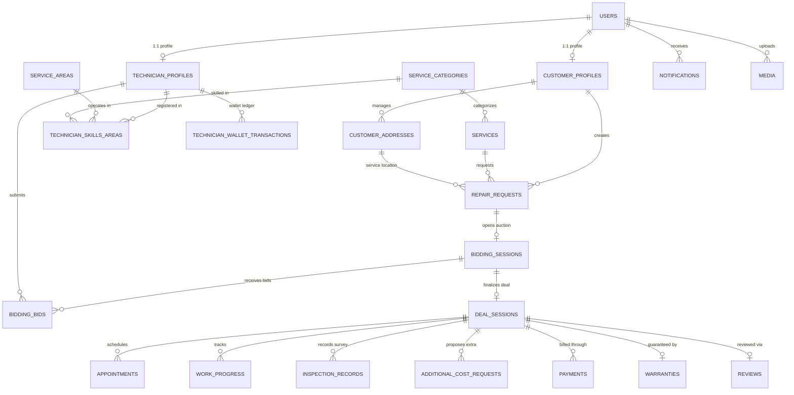

# FixLink - Database Conceptual & Logical Model (Phase 1 & Future Extensibility)

Tài liệu thiết kế mô hình dữ liệu cho nền tảng sửa chữa **FixLink Marketplace**, bao gồm mô hình khái niệm & logic hoàn chỉnh cho **Phase 1** và kiến trúc thiết kế mở rộng sẵn sàng cho các module trong **Phase 2+**.

---

## 1. Nguyên Tắc Thiết Kế Cốt Lõi (Architecture Principles)

1. **Chuẩn hóa dữ liệu (3NF)**: Tránh dư thừa dữ liệu, bảo đảm tính toàn vẹn quan hệ (Referential Integrity) với Foreign Key và CASCADE/SET NULL hợp lý.
2. **Audit & Truy vết (Traceability)**: Mọi bảng nghiệp vụ quan trọng đều có `created_at`, `created_by`, `deleted_at` (Soft Delete) phục vụ kiểm toán.
3. **Phân tách thực thể rõ ràng**: Tách biệt tài khoản đăng nhập chung (`users`) và hồ sơ chuyên biệt theo vai trò (`customer_profiles`, `technician_profiles`).
4. **State Machine rõ ràng**: Các bảng trạng thái (`repair_requests`, `bidding_sessions`, `payments`) sử dụng CHECK Constraints chặt chẽ, ngăn chặn chuyển dịch trạng thái không hợp lệ.
5. **Thiết kế hướng tương lai (Extensibility First)**: Các module mới trong tương lai có thể cắm trực tiếp vào hệ thống mà không phá vỡ schema hiện tại.

---

## 2. Mô Hình Dữ Liệu Phase 1 (Conceptual Model)

Phase 1 bao gồm **21+ bảng cơ sở dữ liệu** được tổ chức theo 5 cụm miền nghiệp vụ (Domains):



---

## 3. Chi Tiết Các Bảng Dữ Liệu Phase 1

### 3.1. Nhóm Tài Khoản & Phân Quyền (Identity & RBAC)
- **`users`**: Thực thể cốt lõi cho mọi actor (CUSTOMER, TECHNICIAN, STAFF, ADMIN). Lưu `username`, `password_hash`, `role`, `status` (ACTIVE, INACTIVE, BANNED).
- **`customer_profiles`**: Thông tin cá nhân khách hàng (`name`, `phone`, `email`, `loyalty_points`).
- **`customer_addresses`**: Danh bạ địa chỉ sửa chữa của khách hàng (`address_line`, `city`, `district`, `lat`, `lng`).
- **`technician_profiles`**: Thông tin thợ (`id_card_number`, `bio`, `rating_avg`, `total_jobs`, `verification_status`, `wallet_balance`).
- **`technician_skills_areas`**: Liên kết nhiều-nhiều giữa kỹ thuật viên với ngành nghề (`category_id`) và địa bàn hoạt động (`area_id`).
- **`technician_wallet_transactions`**: Sổ cái giao dịch ví của thợ (`DEPOSIT`, `WITHDRAW`, `COMMISSION_FEE`, `JOB_PAYOUT`).

### 3.2. Nhóm Danh Mục Dịch Vụ & Khu Vực (Catalog & Territories)
- **`service_categories`**: Các nhóm ngành lớn (Điện, Nước, Điện lạnh, Sơn, Điện tử,...).
- **`services`**: Dịch vụ cụ thể kèm khung giá tham chiếu (`base_price`, `unit`).
- **`service_areas`**: Phân vùng địa lý quản lý (Quận/Huyện/Thành phố).

### 3.3. Nhóm Đấu Giá & Thỏa Thuận (Bidding Marketplace)
- **`repair_requests`**: Phiếu yêu cầu sửa chữa khách hàng tạo (`issue_description`, `urgency`, `preferred_time`, `status`: `DRAFT`, `BIDDING`, `IN_PROGRESS`, `COMPLETED`, `CANCELLED`).
- **`bidding_sessions`**: Phiên đấu giá gắn với yêu cầu (`start_time`, `end_time`, `min_bid`, `max_bid`, `status`).
- **`bidding_bids`**: Báo giá cụ thể từ kỹ thuật viên (`offered_price`, `estimated_duration_hours`, `message`).
- **`deal_sessions`**: Giao dịch đã chốt giữa khách và thợ sau phiên đấu giá (`agreed_price`, `deal_status`).

### 3.4. Nhóm Thi Công & Giám Sát (Execution & Operations)
- **`appointments`**: Lịch hẹn khảo sát hoặc thi công (`appointment_time`, `status`).
- **`work_progress`**: Tiến độ từng giai đoạn (`CHECK_IN`, `DISMANTLE`, `REPLACE_PARTS`, `TEST_RUN`, `CLEAN_UP`).
- **`inspection_records`**: Biên bản khảo sát hiện trường trước khi làm.
- **`additional_cost_requests`**: Báo giá phát sinh vật tư khi thực địa (cần khách hàng duyệt trước khi tiếp tục).

### 3.5. Nhóm Thanh Toán, Bảo Hành & Đánh Giá (Financials & Governance)
- **`payments`**: Bản ghi dòng tiền (`DEPOSIT`, `ESCROW`, `FINAL_PAYMENT`, `REFUND`).
- **`warranties`**: Phiếu bảo hành số sau hoàn thành công việc (`valid_until`, `terms`).
- **`reviews`**: Đánh giá 1-5 sao và nhận xét của khách hàng đối với thợ.
- **`notifications`**: Hệ thống thông báo in-app.
- **`media`**: Quản lý ảnh, video trước/sau sửa chữa.

---

## 4. Kiến Trúc Mở Rộng Cho Phase 2+ (Future Modules Extensibility)

Schema Phase 1 được thiết kế để mở rộng liền mạch mà không cần đập đi xây lại hệ thống:

```
[ Phase 1 Core Database (21 tables) ]
                   │
    ┌──────────────┼──────────────┬──────────────┬──────────────┐
    ▼              ▼              ▼              ▼              ▼
[ Module A ]   [ Module B ]   [ Module C ]   [ Module D ]   [ Module E ]
 Realtime       Escrow &       Dispute &      Tiering &      IoT Smart
 Chat / Msg    Payment GW     Arbitration     Loyalty        Diagnostics
```

### Module A: Trò Chuyện Trực Tuyến (In-App Realtime Chat)
- **Mục tiêu**: Cho phép khách hàng và thợ nhắn tin, gửi ảnh hiện trường trực tiếp trong thời gian đấu giá và thi công.
- **Bảng bổ sung**:
  ```sql
  CREATE TABLE chat_conversations (
      id              BIGSERIAL PRIMARY KEY,
      repair_request_id BIGINT REFERENCES repair_requests(id),
      created_at      TIMESTAMP DEFAULT NOW()
  );
  CREATE TABLE chat_messages (
      id              BIGSERIAL PRIMARY KEY,
      conversation_id BIGINT REFERENCES chat_conversations(id) ON DELETE CASCADE,
      sender_id       BIGINT REFERENCES users(id),
      message_type    VARCHAR(20) DEFAULT 'TEXT', -- TEXT, IMAGE, AUDIO, LOCATION
      content         TEXT,
      media_id        BIGINT REFERENCES media(id),
      is_read         BOOLEAN DEFAULT FALSE,
      created_at      TIMESTAMP DEFAULT NOW()
  );
  ```

### Module B: Escrow & Cổng Thanh Toán Đa Kênh (Payment Gateway Aggregator)
- **Mục tiêu**: Tích hợp VNPay, MoMo, VietQR chuyển khoản tự động và tạm giữ tiền (Escrow) đảm bảo an toàn cho cả hai phía.
- **Bảng bổ sung**:
  ```sql
  CREATE TABLE payment_transactions (
      id              BIGSERIAL PRIMARY KEY,
      payment_id      BIGINT REFERENCES payments(id),
      gateway         VARCHAR(50) NOT NULL, -- VNPAY, MOMO, VIETQR, STRIPE
      gateway_trans_id VARCHAR(100) UNIQUE,
      amount          DECIMAL(12,2) NOT NULL,
      currency        VARCHAR(10) DEFAULT 'VND',
      pay_status      VARCHAR(30) NOT NULL, -- PENDING, SUCCESS, FAILED, REFUNDED
      raw_payload     JSONB,
      created_at      TIMESTAMP DEFAULT NOW()
  );
  ```

### Module C: Giải Quyết Tranh Chấp & Trọng Tài (Dispute & Arbitration)
- **Mục tiêu**: Xử lý khiếu nại của khách khi thợ làm hỏng thiết bị hoặc thợ khiếu nại khách không nghiệm thu.
- **Bảng bổ sung**:
  ```sql
  CREATE TABLE disputes (
      id              BIGSERIAL PRIMARY KEY,
      deal_id         BIGINT REFERENCES deal_sessions(id),
      opened_by       BIGINT REFERENCES users(id),
      dispute_reason  TEXT NOT NULL,
      status          VARCHAR(30) DEFAULT 'OPENED', -- OPENED, UNDER_REVIEW, RESOLVED, REJECTED
      assigned_staff_id BIGINT REFERENCES users(id),
      resolution_notes TEXT,
      refund_amount   DECIMAL(12,2) DEFAULT 0,
      resolved_at     TIMESTAMP
  );
  ```

### Module D: Cấp Bậc Kỹ Thuật Viên & Tích Điểm Thưởng (Tiering & Loyalty)
- **Mục tiêu**: Phân hạng thợ (Đồng, Bạc, Vàng, Kim Cương) dựa trên số sao, tỷ lệ hoàn thành và thâm niên; chương trình đổi điểm lấy mã giảm giá cho khách hàng.
- **Bảng bổ sung**:
  ```sql
  CREATE TABLE technician_tier_rules (
      tier_id         VARCHAR(20) PRIMARY KEY, -- BRONZE, SILVER, GOLD, DIAMOND
      min_completed_jobs INT NOT NULL,
      min_rating      DECIMAL(3,2) NOT NULL,
      commission_discount_percent DECIMAL(5,2) DEFAULT 0.0
  );
  ```

### Module E: Tích Hợp Thiết Bị IoT & Chuẩn Đoán Từ Xa (Smart IoT Diagnostics)
- **Mục tiêu**: Đọc dữ liệu lỗi từ điều hòa, máy giặt thông minh để đề xuất phương án sửa chữa tự động trước khi thợ tới nhà.
- **Bảng bổ sung**:
  ```sql
  CREATE TABLE customer_iot_devices (
      id              BIGSERIAL PRIMARY KEY,
      customer_id     BIGINT REFERENCES customer_profiles(user_id),
      device_type     VARCHAR(50),
      mac_address     VARCHAR(50) UNIQUE,
      last_telemetry  JSONB,
      status          VARCHAR(20)
  );
  ```
