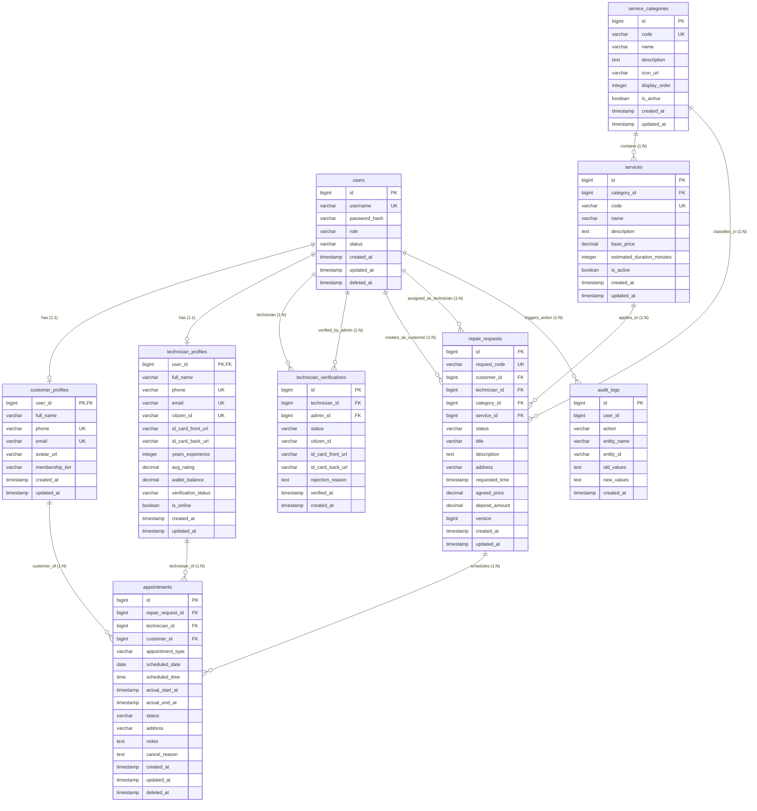

# FIXLINK - TÀI LIỆU THIẾT KẾ CƠ SỞ DỮ LIỆU (DATABASE DESIGN & ERD SPECIFICATION)
> **Hệ quản trị CSDL mục tiêu:** PostgreSQL 15+ (Môi trường Local: H2 Database chế độ PostgreSQL Compatibility Mode)  
> **Công cụ Quản lý Migration:** Flyway Migration Tooling  
> **Phiên bản:** v2.0 (Phase 1 Core Entities + Khung mở rộng tương lai)

---

## 1. TỔNG QUAN & TRIẾT LÝ THIẾT KẾ (DESIGN PHILOSOPHY)

Hệ thống **FixLink** là nền tảng kết nối trực tiếp giữa Khách hàng (Customer) cần sửa chữa thiết bị tại nhà và Kỹ thuật viên / Thợ (Technician). Cơ sở dữ liệu được thiết kế nhằm đạt 4 mục tiêu tối thượng:
1. **Toàn vẹn dữ liệu (Data Integrity):** Ràng buộc khóa ngoại (Foreign Key), kiểm tra ràng buộc duy nhất (Unique), khóa lạc quan (`version` column - Optimistic Locking) nhằm triệt tiêu xung đột trạng thái đồng thời (concurrency state conflict).
2. **Khả năng mở rộng trong tương lai (Extensibility):** Thiết kế Phase 1 bao hàm 8 thực thể cốt lõi, nhưng có cấu trúc khóa ngoại và module hóa để ghép nối liền mạch các tính năng nâng cao (Đấu thầu Bidding, Escrow thanh toán tạm giữ, Khảo sát hiện trường, Bảo hành điện tử, Chat realtime).
3. **Minh bạch kiểm toán (Auditability):** 100% các bảng kế thừa cấu trúc chuẩn 6 cột kiểm toán (`BaseEntity`) phục vụ truy vết thay đổi, định danh người thực hiện và cơ chế xóa mềm (Soft Delete).
4. **Chuẩn hóa Migration (Database Migration Tooling):** Áp dụng **Flyway** để quản lý mọi thay đổi DDL/DML qua các tệp SQL phiên bản (`V1__...`, `V2__...`), loại bỏ hoàn toàn việc chỉnh sửa thủ công trên database.

---

## 2. QUY CHUẨN ĐẶT TÊN (NAMING CONVENTIONS)

Tuân thủ nghiêm ngặt chuẩn quốc tế cho cơ sở dữ liệu quan hệ (PostgreSQL / Relational Database Standards):

| Đối Tượng | Quy Tắc Đặt Tên | Định Dạng Ví Dụ | Ghi Chú |
| :--- | :--- | :--- | :--- |
| **Bảng (Tables)** | `lower_snake_case`, danh từ số nhiều | `users`, `service_categories`, `repair_requests` | Không viết hoa, không dấu tiếng Việt |
| **Cột (Columns)** | `lower_snake_case`, danh từ số ít | `full_name`, `phone`, `base_price`, `status` | Thể hiện rõ ngữ nghĩa |
| **Khóa chính (PK)** | `id` | `id BIGINT` (hoặc `BIGSERIAL`) | Khóa chính đơn nhất, tự tăng |
| **Khóa ngoại (FK)** | `{tên_bảng_số_ít}_id` | `customer_id`, `technician_id`, `category_id` | Tham chiếu chính xác tới `id` bảng cha |
| **Cột Boolean** | Tiền tố `is_` hoặc `has_` | `is_active`, `is_online`, `has_warranty` | Kiểu dữ liệu `BOOLEAN` |
| **Cột Thời gian** | Hậu tố `_at` | `created_at`, `updated_at`, `deleted_at`, `verified_at` | `TIMESTAMP WITH TIME ZONE` |
| **Cột Người thực hiện** | Hậu tố `_by` | `created_by`, `updated_by`, `deleted_by`, `verified_by` | `BIGINT` lưu User ID |
| **Chỉ mục (Index)** | `idx_{bảng}_{cột}` | `idx_users_username`, `idx_repair_requests_status` | Đặt trên các cột hay tìm kiếm / lọc |
| **Ràng buộc duy nhất (Unique)** | `uq_{bảng}_{cột}` | `uq_users_username`, `uq_service_categories_code` | Đảm bảo tính duy nhất |
| **Ràng buộc khóa ngoại (FK)** | `fk_{bảng_con}_{bảng_cha}` | `fk_repair_requests_users_customer` | Ràng buộc toàn vẹn tham chiếu |

---

## 3. QUY CHUẨN 6 CỘT KIỂM TOÁN (AUDIT COLUMNS) & SOFT-DELETE

Mọi bảng trong hệ thống đều kế thừa 6 trường dữ liệu kiểm toán chuẩn từ lớp `BaseEntity`:

```sql
-- Chuẩn 6 cột Audit & Soft-Delete tích hợp trên mọi bảng
created_at   TIMESTAMP WITH TIME ZONE NOT NULL DEFAULT CURRENT_TIMESTAMP,
created_by   BIGINT                   NULL,
updated_at   TIMESTAMP WITH TIME ZONE NOT NULL DEFAULT CURRENT_TIMESTAMP,
updated_by   BIGINT                   NULL,
deleted_at   TIMESTAMP WITH TIME ZONE NULL,
deleted_by   BIGINT                   NULL
```

### Nguyên tắc vận hành:
- **`created_at` & `created_by`:** Tự động gán thời gian hệ thống và ID người dùng khi bản ghi được thêm mới lần đầu (không cho phép sửa đổi).
- **`updated_at` & `updated_by`:** Tự động cập nhật mỗi khi bản ghi có bất kỳ sự thay đổi thông tin nào.
- **Xóa mềm (Soft-Delete) với `deleted_at` & `deleted_by`:**
  - Khi xóa một bản ghi: KHÔNG dùng lệnh `DELETE FROM ...`.
  - Thực hiện cập nhật: `UPDATE ... SET deleted_at = CURRENT_TIMESTAMP, deleted_by = :currentUserId WHERE id = :id`.
  - Mọi câu truy vấn nghiệp vụ mặc định đều có điều kiện: `WHERE deleted_at IS NULL`.
  - Giúp bảo toàn lịch sử giao dịch tài chính, dữ liệu khiếu nại và phục hồi dữ liệu khi cần.

---

## 4. CHI TIẾT 8 THỰC THỂ CỐT LÕI (CORE ENTITIES - PHASE 1)

Theo yêu cầu thiết kế cơ sở dữ liệu:
> *"Identify core entities: User, Role, Customer, Technician, TechnicianVerification, ServiceCategory, Service, RepairRequest"*

### 4.1. Bảng `users` (Tài khoản người dùng)
Lưu trữ thông tin định danh dùng chung cho tất cả các vai trò (Khách hàng, Thợ, Quản trị viên):
```sql
CREATE TABLE users (
    id            BIGSERIAL PRIMARY KEY,
    username      VARCHAR(50)  NOT NULL UNIQUE,
    password_hash VARCHAR(255) NOT NULL,
    role          VARCHAR(20)  NOT NULL, -- 'CUSTOMER', 'TECHNICIAN', 'ADMIN', 'STAFF'
    status        VARCHAR(20)  NOT NULL DEFAULT 'ACTIVE', -- 'ACTIVE', 'PENDING', 'BLOCKED', 'INACTIVE'
    created_at    TIMESTAMP WITH TIME ZONE NOT NULL DEFAULT CURRENT_TIMESTAMP,
    created_by    BIGINT,
    updated_at    TIMESTAMP WITH TIME ZONE NOT NULL DEFAULT CURRENT_TIMESTAMP,
    updated_by    BIGINT,
    deleted_at    TIMESTAMP WITH TIME ZONE,
    deleted_by    BIGINT
);
CREATE INDEX idx_users_username ON users(username);
CREATE INDEX idx_users_role_status ON users(role, status);
```

### 4.2. Bảng `customer_profiles` (Hồ sơ Khách hàng)
Lưu trữ thông tin cá nhân mở rộng của khách hàng (quan hệ 1:1 với `users`):
```sql
CREATE TABLE customer_profiles (
    user_id         BIGINT PRIMARY KEY,
    full_name       VARCHAR(100) NOT NULL,
    phone           VARCHAR(20)  NOT NULL UNIQUE,
    email           VARCHAR(100) NOT NULL UNIQUE,
    avatar_url      VARCHAR(255),
    membership_tier VARCHAR(20)  NOT NULL DEFAULT 'STANDARD', -- 'STANDARD', 'SILVER', 'GOLD', 'VIP'
    created_at      TIMESTAMP WITH TIME ZONE NOT NULL DEFAULT CURRENT_TIMESTAMP,
    created_by      BIGINT,
    updated_at      TIMESTAMP WITH TIME ZONE NOT NULL DEFAULT CURRENT_TIMESTAMP,
    updated_by      BIGINT,
    deleted_at      TIMESTAMP WITH TIME ZONE,
    deleted_by      BIGINT,
    CONSTRAINT fk_customer_profiles_user FOREIGN KEY (user_id) REFERENCES users(id) ON DELETE CASCADE
);
```

### 4.3. Bảng `technician_profiles` (Hồ sơ Kỹ thuật viên / Thợ)
Lưu trữ thông tin năng lực nghề nghiệp, ví tiền và đánh giá của thợ (quan hệ 1:1 với `users`):
```sql
CREATE TABLE technician_profiles (
    user_id             BIGINT PRIMARY KEY,
    full_name           VARCHAR(100) NOT NULL,
    phone               VARCHAR(20)  NOT NULL UNIQUE,
    email               VARCHAR(100) NOT NULL UNIQUE,
    citizen_id          VARCHAR(20)  NOT NULL UNIQUE,
    id_card_front_url   VARCHAR(255) NOT NULL,
    id_card_back_url    VARCHAR(255) NOT NULL,
    avatar_url          VARCHAR(255),
    bio                 TEXT,
    years_experience    INTEGER      DEFAULT 0,
    avg_rating          DECIMAL(3,2) DEFAULT 0.00,
    completed_jobs      INTEGER      DEFAULT 0,
    wallet_balance      DECIMAL(12,0) DEFAULT 0, -- Số dư ví tính bằng VNĐ
    verification_status VARCHAR(20)  NOT NULL DEFAULT 'PENDING', -- 'PENDING', 'APPROVED', 'REJECTED'
    verified_at         TIMESTAMP WITH TIME ZONE,
    verified_by         VARCHAR(50),
    rejection_reason    TEXT,
    is_online           BOOLEAN      DEFAULT FALSE,
    created_at          TIMESTAMP WITH TIME ZONE NOT NULL DEFAULT CURRENT_TIMESTAMP,
    created_by          BIGINT,
    updated_at          TIMESTAMP WITH TIME ZONE NOT NULL DEFAULT CURRENT_TIMESTAMP,
    updated_by          BIGINT,
    deleted_at          TIMESTAMP WITH TIME ZONE,
    deleted_by          BIGINT,
    CONSTRAINT fk_technician_profiles_user FOREIGN KEY (user_id) REFERENCES users(id) ON DELETE CASCADE
);
CREATE INDEX idx_technician_verification_status ON technician_profiles(verification_status);
CREATE INDEX idx_technician_online_status ON technician_profiles(is_online);
```

### 4.4. Bảng `technician_verifications` (Lịch sử Xác minh KYC Thợ)
Lưu trữ chi tiết từng đợt gửi hồ sơ eKYC CCCD 2 mặt và quyết định phê duyệt/từ chối của Admin/Staff (quan hệ 1:N với `users`):
```sql
CREATE TABLE technician_verifications (
    id                BIGSERIAL PRIMARY KEY,
    technician_id     BIGINT       NOT NULL,
    admin_id          BIGINT,
    status            VARCHAR(20)  NOT NULL DEFAULT 'PENDING', -- 'PENDING', 'APPROVED', 'REJECTED'
    citizen_id        VARCHAR(20)  NOT NULL,
    id_card_front_url VARCHAR(255) NOT NULL,
    id_card_back_url  VARCHAR(255) NOT NULL,
    rejection_reason  TEXT,
    notes             TEXT,
    verified_at       TIMESTAMP WITH TIME ZONE,
    created_at        TIMESTAMP WITH TIME ZONE NOT NULL DEFAULT CURRENT_TIMESTAMP,
    created_by        BIGINT,
    updated_at        TIMESTAMP WITH TIME ZONE NOT NULL DEFAULT CURRENT_TIMESTAMP,
    updated_by        BIGINT,
    deleted_at        TIMESTAMP WITH TIME ZONE,
    deleted_by        BIGINT,
    CONSTRAINT fk_tech_verify_technician FOREIGN KEY (technician_id) REFERENCES users(id),
    CONSTRAINT fk_tech_verify_admin FOREIGN KEY (admin_id) REFERENCES users(id)
);
CREATE INDEX idx_tech_verify_tech_id ON technician_verifications(technician_id);
CREATE INDEX idx_tech_verify_status ON technician_verifications(status);
```

### 4.5. Bảng `service_categories` (Danh mục Ngành nghề Sửa chữa)
Lưu trữ các nhóm danh mục dịch vụ lớn (Điện lạnh, Điện nước, Gia dụng, Khóa cửa...):
```sql
CREATE TABLE service_categories (
    id            BIGSERIAL PRIMARY KEY,
    code          VARCHAR(50)  NOT NULL UNIQUE, -- 'DIEN_LANH', 'DIEN_NUOC', 'KHOA_CUA', 'DO_GIA_DUNG'
    name          VARCHAR(100) NOT NULL,
    description   TEXT,
    icon_url      VARCHAR(255),
    display_order INTEGER      DEFAULT 0,
    is_active     BOOLEAN      DEFAULT TRUE,
    created_at    TIMESTAMP WITH TIME ZONE NOT NULL DEFAULT CURRENT_TIMESTAMP,
    created_by    BIGINT,
    updated_at    TIMESTAMP WITH TIME ZONE NOT NULL DEFAULT CURRENT_TIMESTAMP,
    updated_by    BIGINT,
    deleted_at    TIMESTAMP WITH TIME ZONE,
    deleted_by    BIGINT
);
CREATE INDEX idx_categories_code ON service_categories(code);
CREATE INDEX idx_categories_active ON service_categories(is_active);
```

### 4.6. Bảng `services` (Chi tiết Gói dịch vụ Sửa chữa)
Lưu trữ các dịch vụ cụ thể thuộc từng danh mục kèm giá niêm yết cơ sở (quan hệ N:1 với `service_categories`):
```sql
CREATE TABLE services (
    id                         BIGSERIAL PRIMARY KEY,
    category_id                BIGINT       NOT NULL,
    code                       VARCHAR(50)  NOT NULL UNIQUE,
    name                       VARCHAR(150) NOT NULL,
    description                TEXT,
    base_price                 DECIMAL(12,0) NOT NULL DEFAULT 0, -- Giá sàn niêm yết (VNĐ)
    estimated_duration_minutes INTEGER      DEFAULT 60,
    is_active                  BOOLEAN      DEFAULT TRUE,
    created_at                 TIMESTAMP WITH TIME ZONE NOT NULL DEFAULT CURRENT_TIMESTAMP,
    created_by                 BIGINT,
    updated_at                 TIMESTAMP WITH TIME ZONE NOT NULL DEFAULT CURRENT_TIMESTAMP,
    updated_by                 BIGINT,
    deleted_at                 TIMESTAMP WITH TIME ZONE,
    deleted_by                 BIGINT,
    CONSTRAINT fk_services_category FOREIGN KEY (category_id) REFERENCES service_categories(id)
);
CREATE INDEX idx_services_category_id ON services(category_id);
CREATE INDEX idx_services_code ON services(code);
```

### 4.7. Bảng `repair_requests` (Yêu cầu Sửa chữa của Khách hàng)
Trái tim của hệ thống kết nối. Quản lý trạng thái vòng đời từ khi đăng sự cố đến khi hoàn tất nghiệm thu:
```sql
CREATE TABLE repair_requests (
    id             BIGSERIAL PRIMARY KEY,
    request_code   VARCHAR(50)  NOT NULL UNIQUE, -- VD: 'REQ-20260918-0001'
    customer_id    BIGINT       NOT NULL,
    technician_id  BIGINT,                   -- Gán sau khi khách chọn thợ
    category_id    BIGINT       NOT NULL,
    service_id     BIGINT,
    status         VARCHAR(30)  NOT NULL DEFAULT 'PENDING',
    -- Các trạng thái: 'PENDING', 'BIDDING_OPEN', 'TECHNICIAN_SELECTED', 'INSPECTING', 
    --                 'AWAITING_COST_APPROVAL', 'IN_PROGRESS', 'COMPLETED', 'CANCELLED'
    title          VARCHAR(200) NOT NULL,
    description    TEXT         NOT NULL,
    address        VARCHAR(255) NOT NULL,
    requested_time TIMESTAMP WITH TIME ZONE NOT NULL,
    agreed_price   DECIMAL(12,0) DEFAULT 0,  -- Giá chốt dịch vụ
    deposit_amount DECIMAL(12,0) DEFAULT 0,  -- Tiền cọc tạm giữ (Escrow)
    version        BIGINT       DEFAULT 0,   -- Optimistic Lock chống xung đột trạng thái
    created_at     TIMESTAMP WITH TIME ZONE NOT NULL DEFAULT CURRENT_TIMESTAMP,
    created_by     BIGINT,
    updated_at     TIMESTAMP WITH TIME ZONE NOT NULL DEFAULT CURRENT_TIMESTAMP,
    updated_by     BIGINT,
    deleted_at     TIMESTAMP WITH TIME ZONE,
    deleted_by     BIGINT,
    CONSTRAINT fk_repair_req_customer FOREIGN KEY (customer_id) REFERENCES users(id),
    CONSTRAINT fk_repair_req_technician FOREIGN KEY (technician_id) REFERENCES users(id),
    CONSTRAINT fk_repair_req_category FOREIGN KEY (category_id) REFERENCES service_categories(id),
    CONSTRAINT fk_repair_req_service FOREIGN KEY (service_id) REFERENCES services(id)
);
CREATE INDEX idx_repair_requests_customer ON repair_requests(customer_id);
CREATE INDEX idx_repair_requests_technician ON repair_requests(technician_id);
CREATE INDEX idx_repair_requests_status ON repair_requests(status);
```

### 4.8. Bảng `audit_logs` (Nhật ký Kiểm toán Toàn hệ thống)
Ghi nhận toàn bộ biến động dữ liệu nhạy cảm (thay đổi hồ sơ, duyệt thợ, khóa nick, chuyển trạng thái đơn hàng):
```sql
CREATE TABLE audit_logs (
    id          BIGSERIAL PRIMARY KEY,
    user_id     BIGINT,
    action      VARCHAR(50)  NOT NULL,
    entity_name VARCHAR(50)  NOT NULL,
    entity_id   VARCHAR(50)  NOT NULL,
    old_values  TEXT,
    new_values  TEXT,
    created_at  TIMESTAMP WITH TIME ZONE NOT NULL DEFAULT CURRENT_TIMESTAMP
);
CREATE INDEX idx_audit_logs_user_action ON audit_logs(user_id, action);
CREATE INDEX idx_audit_logs_entity ON audit_logs(entity_name, entity_id);
```

### 4.9. Bảng `appointments` (Lịch hẹn Khảo sát, Sửa chữa, Bảo hành - Jira RC-48)
*Chuẩn hóa 100% theo sơ đồ kiến trúc `database-erd.jpg`:*
```sql
CREATE TABLE appointments (
    id                  BIGSERIAL PRIMARY KEY,
    repair_request_id   BIGINT NOT NULL,
    technician_id       BIGINT NOT NULL,
    customer_id         BIGINT NOT NULL,
    appointment_type    VARCHAR(30) NOT NULL DEFAULT 'REPAIR' 
                        CHECK (appointment_type IN ('SURVEY', 'REPAIR', 'WARRANTY')),
    scheduled_date      DATE NOT NULL,
    scheduled_time      TIME NOT NULL,
    actual_start_at     TIMESTAMP WITH TIME ZONE,
    actual_end_at       TIMESTAMP WITH TIME ZONE,
    status              VARCHAR(30) NOT NULL DEFAULT 'CONFIRMED'
                        CHECK (status IN ('CONFIRMED', 'RESCHEDULED', 'COMPLETED', 'CANCELLED')),
    address             VARCHAR(255),
    notes               TEXT,
    cancel_reason       TEXT,
    created_at          TIMESTAMP WITH TIME ZONE NOT NULL DEFAULT CURRENT_TIMESTAMP,
    created_by          BIGINT,
    updated_at          TIMESTAMP WITH TIME ZONE NOT NULL DEFAULT CURRENT_TIMESTAMP,
    updated_by          BIGINT,
    deleted_at          TIMESTAMP WITH TIME ZONE,
    deleted_by          BIGINT,
    CONSTRAINT fk_appointments_request FOREIGN KEY (repair_request_id) REFERENCES repair_requests(id),
    CONSTRAINT fk_appointments_technician FOREIGN KEY (technician_id) REFERENCES technician_profiles(user_id),
    CONSTRAINT fk_appointments_customer FOREIGN KEY (customer_id) REFERENCES customer_profiles(user_id)
);
CREATE INDEX idx_appointments_request ON appointments(repair_request_id);
CREATE INDEX idx_appointments_customer ON appointments(customer_id);
CREATE INDEX idx_appointments_technician ON appointments(technician_id);
CREATE INDEX idx_appointments_date ON appointments(scheduled_date);
CREATE INDEX idx_appointments_status ON appointments(status);
```

---

## 5. KHUNG MỞ RỘNG CHO CÁC MODULE TƯƠNG LAI (EXTENSIBLE MODULES)

Cơ sở dữ liệu được thiết kế sẵn điểm tựa khóa ngoại (`repair_request_id`, `user_id`, `technician_id`) cho các phase tiếp theo:

```text
repair_requests (Lõi)
    ├── 1:N ➔ appointments (Lịch hẹn Khảo sát, Sửa chữa, Bảo hành - RC-48)
    ├── 1:N ➔ quotations (Báo giá thợ gửi đến)
    ├── 1:1 ➔ inspection_records (Biên bản khảo sát hiện trường)
    │            └── 1:N ➔ additional_costs (Chi phí vật tư/nhân công phát sinh)
    ├── 1:N ➔ work_progress (Nhật ký tiến độ & Máy trạng thái)
    ├── 1:N ➔ payments (Thanh toán cọc & thanh toán tất toán)
    │            └── 1:1 ➔ escrow_transactions (Tài khoản tạm giữ ký quỹ)
    ├── 1:1 ➔ reviews (Đánh giá & chấm điểm thợ sau hoàn thành)
    ├── 1:1 ➔ warranties (Phiếu bảo hành điện tử)
    ├── 1:1 ➔ disputes (Khiếu nại / tranh chấp tiền cọc)
    └── 1:N ➔ media_attachments (Ảnh/video hiện trường trước và sau sửa)
```

---

## 6. SƠ ĐỒ THỰC THỂ LIÊN KẾT (MERMAID ERD DIAGRAM)



---

## 7. CẤU HÌNH CÔNG CỤ MIGRATION (FLYWAY TOOLING)

Hệ thống sử dụng **Flyway** để quản lý các file SQL Migration tại thư mục `src/main/resources/db/migration/`:

1. **`V1__initial_schema_baseline.sql`**: Khởi tạo cấu trúc 8 bảng cốt lõi Phase 1, các chỉ mục (indexes), khóa ngoại (foreign keys) và ràng buộc toàn vẹn.
2. **`V2__seed_master_data.sql`**: Nạp sẵn danh mục dịch vụ mẫu (`DIEN_LANH`, `DIEN_NUOC`, `KHOA_CUA`, `DO_GIA_DUNG`), các dịch vụ con và các tài khoản kiểm thử tiêu chuẩn.

### Cấu hình `application.yml`:
```yaml
spring:
  flyway:
    enabled: true
    baseline-on-migrate: true
    baseline-version: 0
    locations: classpath:db/migration
```

Khi ứng dụng Spring Boot khởi động, Flyway tự động kiểm tra bảng `flyway_schema_history`, thực thi các script mới theo đúng thứ tự phiên bản mà không làm mất dữ liệu hiện có.
